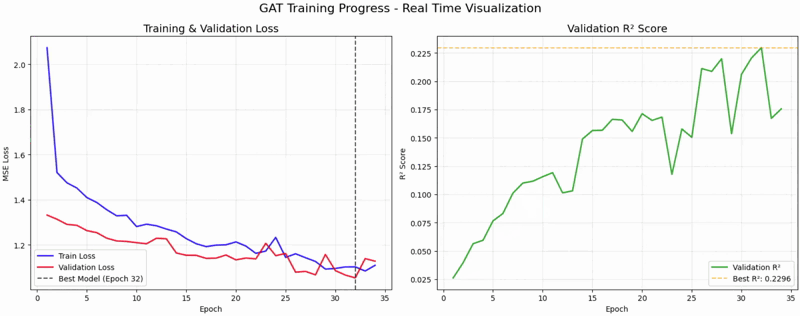
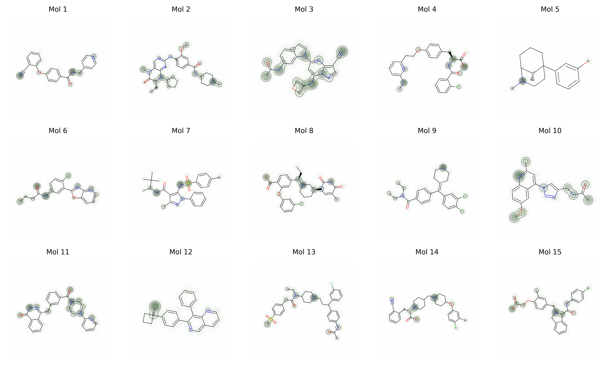

# GAT-sweetpred

原作：b站up主 `_小闪电_`[代码讲解视频](https://www.bilibili.com/video/BV1p1ZoYQEaR?vd_source=fa81f76c79d0c0db67a23747290f548c)

改编 by：[LHH90538](https://github.com/LHH90538)

声明：感谢up主为我们带来优质的AI+药物/化学等相关内容！

### 优化内容：
- 对文件进行整理分类


- 梯度下降使用动图展示



- 分子热图可输出总图



- 优化了数据集


## 使用教程

### 安装必要库
```
pip install -r requirements.txt
```

打开`GATmodel.ipynb`文件，一步步运行

Enjoy yourself!


### 推荐训练参数
- lr = 0.0005
- weight_decay = 1e-4
- train_ratio = 0.8
- batch_size = 128
- epoches = 200

效果：train_loss = 0.5278, R2 = 0.5494
